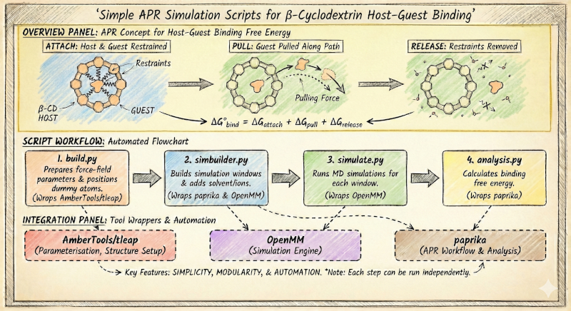

# Simple APR Simulation Scripts for β-Cyclodextrin Host–Guest Binding

> ### :warning: Note
> 
> This repository was built in 2021 and is no longer actively maintained.
> (latest dependency update: paprika(v1.1.0), openmm(v7.6.0), ambertools(v23.3))
>

## Background
Host-guest complexes are molecular systems where a larger "host" molecule encapsulates a smaller "guest" molecule. This interaction alters the physical properties of the guest without changing its chemical structure. This mechanism is highly relevant in three areas of application:
1. **Consumer Goods**: Trapping malodors or stabilize fragrances in products like air fresheners (->Febreze).
2. **Pharmaceuticals**: Delivering insoluble medication to the body by encapsulation.
3. **Method Development**: Testing systems to improve modelling of host-guest binding to improve predictions on pharmaceutical drug-protein interactions and drug discovery.

## Current Limitation
Accuratly estimating the binding energy between host and guest is central to the application of host-guest complexes. The Attach-Pull-Release (APR) method is a molecular dynamics (MD) based free energy calculation technique to achieve this. It works by restraining, pulling, and releasing the guest molecule from the host, allowing accurate computation of binding thermodynamics:

1. __Attach__: The guest molecule is gradually restrained to the host binding site using harmonic restraints. This keeps them in a specific orientation and limit their movement to create a stable starting point and allow the software to measure the energy required to hold them in place.
2. __Pull__: The guest is slowly "pulled" away from the guest binding site into the bulk solvent (water) along a defined path. The simulation calculates the work (energy) required to separate the two molecules against their attractive forces, typically using several dozens of sampling windows.
3. __Release__: Once the guest is far enough away that it no longer interacts with the host, the artificial restraints applied in Phase 1 are "released" (turned off). This returns the guest and host to their natural, unrestrained states in the solvent.

Together, these steps yield the absolute binding free energy by integrating over the restraint work and the potential of mean force along the pulling coordinate.

> ### 🚩Challenge
> The complexity of repeatedly integrating multiple software tools in APR simulations hinders accessibility and increases the risk of error.

## Overview
This repository provides a Python workflow that simplifies APR simulations for β‑cyclodextrin host–guest complexes, reducing complexity and improving reproducibility.

The code in `/src/bcdmd` is structured more like a collection of scripts than a roboust python package, wrapping functionalities of [paprika](https://github.com/GilsonLabUCSD/pAPRika), [ambertools](https://ambermd.org/AmberTools.php) and [openmm](https://github.com/openmm/openmm) into a simple workflow for β-CD host-guest complexes. As their file names imply, four key tasks are addressed:

| file | purpose|
|------|--------|
| _build.py_ | executes _ambertools/tleap_ to generate the force-field parameters for the host-guest complex while positioning dummy-atoms needed for the APR setup |
| _simbuilder.py_ | generates the APR pull-windows with _pAPRika_ and builds their simulation setup in _openmm_-format, while adding explicit solvent molecules and ions |
| _simulate.py_ | executes the _openmm_ simulations of each window, initialising or appending to existing simulation data |
| _analysis.py_ | executes the free-energy calculation in _pAPRika_ for the guest binding in the host based on the collected MD trajectories |

### Usage
Below is a typical workflow using the scripts in `src/bcdmd` for β-CD host–guest APR simulations. Each step can be run independently, allowing flexible and modular execution.

#### 1. Build the Host–Guest System
Here, the General AMBER Force Field (GAFF) is used. Alternatively, GLYCAM_06j-1 is also implemented by using _Glycam_ as keyword instead. In this case, the β-CD in the _complex.pdb_ has to be written in the glycam-specific format.
First, the force-field parameters are applied, then the complex is aligned in z-direction of the periodic cell and the dummy-atoms are added to anchor the complex. Hydrogen Mass Repartitioning (HMR) is applied to enable larger time steps (4 fs) during MD simulations.

```python
from bcdmd.build import HostGuestComplexSetup

apr_dir = "/path/to/APR_sims/"
guest_id = "ANA" #ligand id used in complex.pdb file
complex_pdb = "complex.pdb"
hgcs = HostGuestComplexSetup(apr_dir, complex_pdb, guest_id, "GAFF2")

hgcs.parameterise_structure()
hgcs.positioning_complex(":ANA@C9", ":ANA@C3")
hgcs.provide_dummies()
```

#### 2. Prepare Simulation Windows
The simulation windows are build, gradually pulling the guest molecule along the z-axis (here C9 -> C3) out of the guest molecule. Each window is written to a separate directory with its corresponding structure and force-field files for execution with openmm. The existing windows are solvated during a second build-process.

```python
from bcdmd.simbuilder import HostGuestComplexSimulationBuilder

hgcsb = HostGuestComplexSimulationBuilder(apr_dir, True, "GAFF")
hgcsb.apply_restraints(":ANA@C9", ":ANA@C3")
# first complex only
hgcsb.APR_build(guest_id=pdb_id, guest=pdb_id, solvate=False)
# then add solvation
hgcsb.APR_build(guest_id=pdb_id, guest=pdb_id, solvate=True)
```

#### 3. Run Simulations
Simulations are executed via openmm, applying pre-set conditions of 300K with a Langevin-Middle integrator. Initial runs execute a minimisation and NPT sequence automatically. 

```python
from bcdmd.simulate import MDrunAPR

# Run MD for each window
# use restart=False for initial runs
# and restart=True to continue
FRAME_list = ["a000"]
loop = 0
while FRAME_list and loop < 5:
    loop += 1
    FRAME_list = MDrunAPR(FRAME_list, f"{apr_dir}/apr_windows/")
    print(FRAME_list, f"...after: {loop} loop")
```

#### 4. Analyze Results
Wraps the analysis steps as implemented in [_paprika_](https://paprika.readthedocs.io/en/latest/workflow.html#analysis).

```python
from bcdmd.analysis import APRanalysis

fe = APRanalysis(apr_dir, pdb_id)
fe.pull_Data()
fe.run_Thermo()
fe.summarize_APR()
fe.plot_SEMatrix("pull")
```

> See [`notebooks/APR_system_GAFF.ipynb`](notebooks/APR_system_GAFF.ipynb) for a full workflow example.

